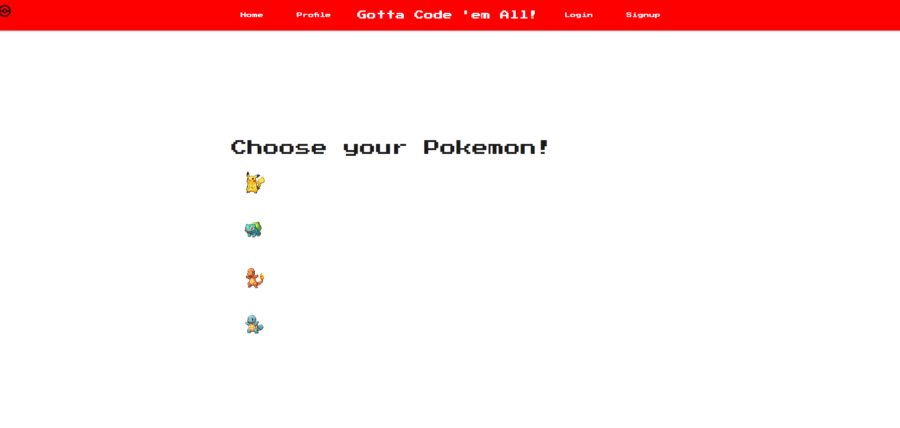

# Gotta Code 'em All
Create/save teams of Pokemon with evolution info

  ## Description
  

  Motivation - 
Our motivation is to build a Pokémon site that allows users to discover the evolution levels and methods for each Pokémon.

Purpose - 
This app aims to provide a tracker for finding out what level or how your Pokemon evolves, as well as for building a team you like.

Problem Solved - 
We got the Pokemon data, full CRUD, running well, and a working login and sign-up. The person's information is kept in the database so they can log in and out anytime. The teams are also saved on what Pokemon you want; you can have more than one team and delete the team when you don't want them. 

Lessons Learned - 
Understanding Node.js and its capabilities.
Utilizing the terminal for project management and debugging.

Unique Features - 
This project lets users pick Pokémon and view their evolution details, including the required levels, items, and conditions.

See the deployed site at https://gotta-code.onrender.com/

  ## Table of Contents

  * [Installation](#installation)
  * [Usage](#usage)
  * [Credits](#credits)
  * [License](#license)
  * [Contributing](#contributing)
  * [Tests](#tests)
  * [Badges](#badges)
  * [Questions](#questions)

  ## Installation

  To install, clone repo to user's local files. In the command line, run npm install to install dependencies. 

  ## Usage

Once repo is in local files, enter Postgres in the command line. Run \i db/schema.sql to create database. Exit Postgres. Run npm run seed to seed database. Run npm start to start application. Go to live site and interact with the links and input fields

  ## Credits

  We would like to thank our classmates, TAs, and tutors in the UCF Bootcamp for their advice and access to resources. 

  ## License

  
  This project is licensed under the MIT License.

  [License: MIT](https://opensource.org/licenses/MIT)

  ## Contributing

  If you would like to make any contributions, please make any changes in a branch and submit a pull request with detailed comments.

  ## Tests

  See Usage 

  ## Badges
    

  ## Questions

  For more information, see my [GitHub](https://github.com/42Salokin)

  Send any questions or comments to nicholas.dpoul@gmail.com

